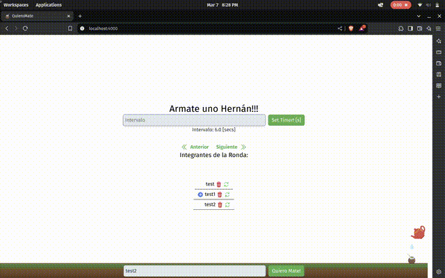

<h1 align="center">Quiero Mate 🧉</h1>

[Why?](#why) - [What?](#what) - [How?](#how)

# Why

The goal of this project is to learn about the channels/sockets that Phoenix uses to interact with JavaScript.

# What

The webpage is designed to organize a queue for drinking mate.

  

# How

Dependencies:
- Erlang
- Elixir and Phoenix
- Linux: `notify-send`
  - Ubuntu: `sudo apt install libnotify-bin`

To start the app:
  - PROD: `MIX_ENV=prod make run`
  - DEV: `make run` 

To start the app for debugging:
  - Run `mix setup` to install and setup dependencies
  - Start Phoenix endpoint with `mix phx.server` or inside IEx with `iex -S mix phx.server`

### Notes

- The `Dockerfile` was created with `mix phx.gen.release --docker`
- To use the notifications with docker (Tested on Ubuntu) `sudo` has to be used.

### Resources

- [dbus - libnotify with Docker](https://unix.stackexchange.com/questions/546726/setup-docker-container-to-communicate-with-host-over-d-bus)
